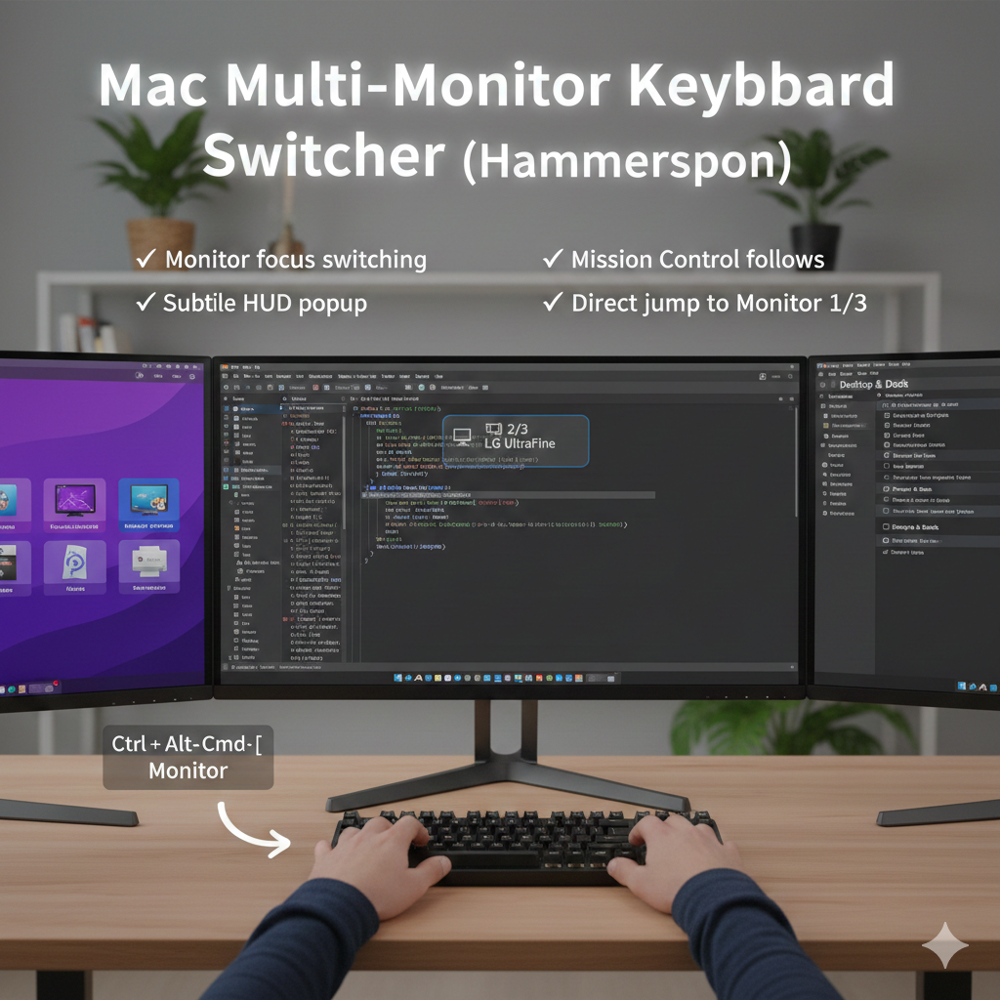

# Mac Multi-Monitor Keyboard Switcher

> **Hammerspoon config for keyboard-driven monitor focus switching on macOS**

[](https://www.apple.com/macos/)
[](https://www.hammerspoon.org/)
[](LICENSE)

Stop reaching for your mouse just to switch monitor focus. This tiny Hammerspoon config lets you move keyboard focus between external monitors instantly — and makes Mission Control follow correctly.

---

## Table of Contents

- [Why this exists](#why-this-exists)
- [Features](#features)
- [Demo](#demo)
- [Keyboard Shortcuts](#keyboard-shortcuts)
- [Requirements](#requirements)
- [Setup](#setup)
- [Troubleshooting](#troubleshooting)

---

## Why this exists

macOS does **not** provide a reliable built-in keyboard shortcut to focus a specific monitor.

Even though macOS supports switching Spaces with keyboard shortcuts, **Mission Control and Space switching only work on the currently focused display** — and the focused display is typically tied to the mouse pointer position.

This project fixes that by:

1. Moving keyboard focus to the target monitor
2. Moving the mouse cursor to that monitor (so Mission Control follows correctly)
3. Showing a subtle HUD notification on the target monitor

---

## Features

- **Next / Previous monitor switching** — cycle through all monitors with one shortcut
- **Direct jump** to Monitor 1, 2, or 3 by number
- **Mission Control follows** — mouse is repositioned so Spaces switching always targets the right display
- **Subtle HUD overlay** — shows which monitor is active (e.g., `🖥 2/3  LG UltraFine`)
- **"Where am I?"** shortcut — shows current monitor anytime
- **Quick config reload** — reload Hammerspoon without leaving the keyboard

---

## Demo


The HUD appears briefly at the bottom of the newly focused monitor, showing its position in the layout and its display name. It fades in and out quickly so it doesn't interrupt your workflow.

---

## Keyboard Shortcuts

All shortcuts use the **Hyper key**: `Ctrl + Alt + Cmd`

### Monitor Navigation

| Shortcut | Action |
|---|---|
| `Hyper + ]` | Focus **next** monitor (cycle right) |
| `Hyper + [` | Focus **previous** monitor (cycle left) |
| `Hyper + 1` | Jump directly to **Monitor 1** |
| `Hyper + 2` | Jump directly to **Monitor 2** |
| `Hyper + 3` | Jump directly to **Monitor 3** |

> Monitor order is sorted by physical position left → right.

### Utilities

| Shortcut | Action |
|---|---|
| `Hyper + /` | Show current monitor HUD |
| `Hyper + R` | Reload Hammerspoon config |

---

## Requirements

- **macOS** (any recent version)
- **2 or more monitors** (works best with 2–3 displays)
- [**Hammerspoon**](https://www.hammerspoon.org/) installed

---

## Setup

### 1. Enable "Displays have separate Spaces"

Go to: **System Settings → Desktop & Dock → Mission Control**

Enable: ✅ **Displays have separate Spaces**

> macOS may require a logout/login once after enabling this setting.

---

### 2. Install Hammerspoon

Download and install from [hammerspoon.org](https://www.hammerspoon.org/).

If macOS blocks the app (Gatekeeper):
- Right-click the app → **Open**
- Or: **System Settings → Privacy & Security → Open Anyway**

---

### 3. Grant Accessibility Permission

Go to: **System Settings → Privacy & Security → Accessibility**

Enable: ✅ **Hammerspoon**

Without this, monitor focus switching will not work correctly.

---

### 4. Install the config

Copy `init.lua` into your Hammerspoon config directory:

```bash
mkdir -p ~/.hammerspoon
cp init.lua ~/.hammerspoon/init.lua
```

Or create it manually:

```bash
mkdir -p ~/.hammerspoon
touch ~/.hammerspoon/init.lua
open ~/.hammerspoon/init.lua
```

Then paste the contents of `init.lua` into the file.

---

### 5. Reload Hammerspoon

Click the Hammerspoon menubar icon → **Reload Config**

Or use the shortcut once the config is loaded: `Ctrl + Alt + Cmd + R`

---

## Troubleshooting

**Shortcuts don't work / nothing happens**
- Confirm Hammerspoon has Accessibility permission (Step 3 above)
- Check the Hammerspoon console for errors: menubar icon → **Open Console**

**Mission Control opens on the wrong monitor**
- Make sure "Displays have separate Spaces" is enabled (Step 1 above)
- After enabling, log out and back in

**Only 2 monitors but I see no Monitor 3 shortcut**
- `Hyper + 3` will silently do nothing if a third screen doesn't exist — this is expected behavior

**Config changes aren't taking effect**
- Use `Hyper + R` to reload, or click the Hammerspoon menubar icon → **Reload Config**

---

## License

MIT — use freely, modify as needed.
